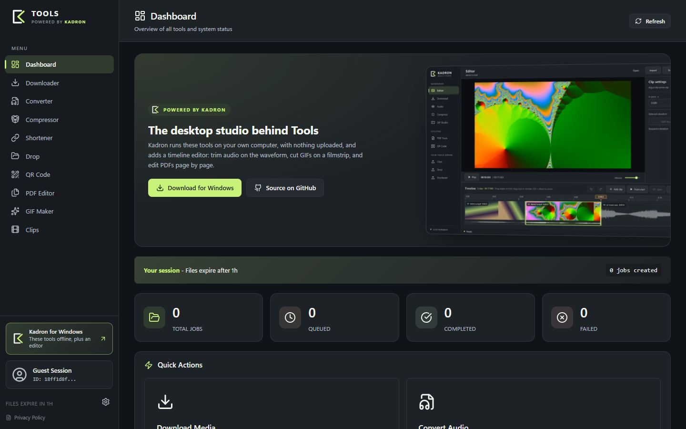
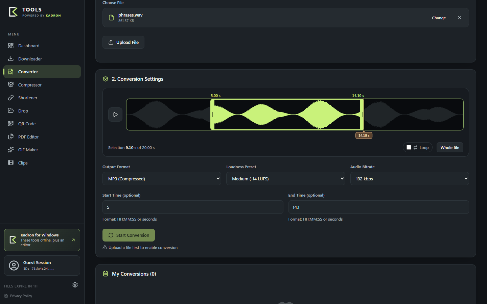
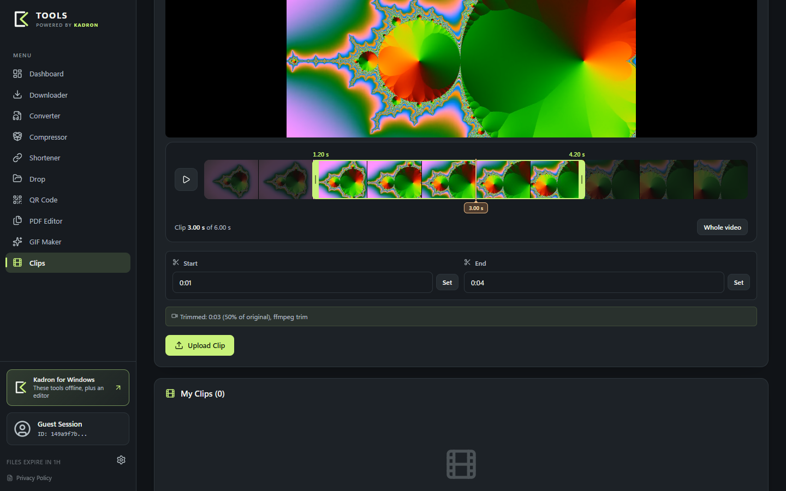

# Tools

Self-hosted media toolkit — video downloading, audio conversion, compression, file sharing, URL shortening, PDF editing, GIF creation, QR codes, and video clip hosting with Discord embeds.

Tools is the web side of [Kadron](https://github.com/al3ksh/Kadron): the same tools, served from your own server (a Raspberry Pi is enough) and shared with anyone who has the link. Kadron is the desktop app for Windows — it runs everything locally, with nothing uploaded, and adds a timeline editor.




| Audio trimmer | Clip trimmer |
|---|---|
|  |  |

## Features

- **Universal Downloader** — YouTube, TikTok, Instagram, Twitter & 1000+ sites via `yt-dlp`
- **Audio Converter** — MP3, FLAC, WAV, Opus with FFmpeg loudness normalization; trim on the waveform with loop preview
- **Compressor** — Shrink video, audio and images to a target size
- **Video Clips** — Upload videos, trim on a filmstrip, server-side cut via FFmpeg, share with Discord/Twitter embeds
- **GIF Maker** — Upload video, pick a segment on the filmstrip, preview and generate an animated GIF
- **PDF Editor** — Merge, rotate, split, reorder, remove pages, images-to-PDF
- **QR Code Generator** — PNG and SVG with custom colors and error correction
- **Link Shortener** — Custom slugs with click tracking, auto-expiration
- **File Drop** — Upload and share files via unique links (optional password protection)
- **Admin Panel** — Shared admin account with unlimited uploads, no file expiration
- **Per-Session Data** — Each guest gets isolated history via browser session
- **Large Uploads** — Files are sent in chunks, so uploads work behind proxies with request size limits (e.g. Cloudflare's 100 MB)
- **Dark / Light Mode** — Toggleable theme, same look as Kadron

## Quick Start

### Prerequisites

- [Docker](https://docs.docker.com/get-docker/) & [Docker Compose](https://docs.docker.com/compose/install/)

### Setup

```bash
# 1. Clone the repository
git clone https://github.com/al3ksh/Tools.git
cd Tools

# 2. Create your .env file
cp .env.example .env
# Edit .env and set a strong ADMIN_PASSWORD and ADMIN_JWT_SECRET

# 3. Start the application
docker compose up -d --build

# 4. Open in browser
# http://localhost:3000
```

### Environment Variables

| Variable | Default | Description |
|---|---|---|
| `ADMIN_PASSWORD` | *(required)* | Password for the admin panel |
| `ADMIN_JWT_SECRET` | *(required)* | JWT signing secret for admin cookies |
| `BASE_URL` | — | Public URL for OG embeds and generated short links (e.g. `https://tools.yourdomain.com`) |
| `CORS_ORIGINS` | `http://localhost:3000` | Allowed web origins (comma-separated) |
| `TRUST_PROXY` | `false` | Set to `true` behind a reverse proxy or Cloudflare Tunnel, so rate limits and links use the visitor's IP and scheme |
| `API_HEAVY_CONCURRENCY` | `1` | Concurrent PDF/GIF/clip tasks in the API (keep `1` on a Raspberry Pi) |
| `DB_SCHEMA_WAIT_MS` | `60000` | How long the worker waits for the API to create the database |
| `DATA_DIR` | `/data` | Data directory inside the container |
| `PORT` | `3001` | Internal API port (mapped to 3000 externally) |

## Architecture

```
Tools/
├── apps/
│   ├── api/          # Express REST API + static file server (CommonJS)
│   │   ├── db/       # SQLite schema, migrations, prepared statements
│   │   ├── routes/   # API route handlers
│   │   └── src/      # Server entry point, middleware
│   ├── web/          # React 18 + Vite frontend (ESM)
│   │   └── src/
│   │       ├── components/   # Reusable UI components
│   │       ├── hooks/        # Custom React hooks
│   │       └── pages/        # Page-level components
│   └── worker/       # Background job processor (yt-dlp, ffmpeg)
├── packages/
│   └── shared/       # Shared constants (PRESETS, JOB_STATUS, JOB_TYPE)
├── data/             # Persistent storage (SQLite DB, uploaded files)
├── docker-compose.yml
├── Dockerfile.api    # API-only build
├── Dockerfile.web    # API + Web build
└── Dockerfile.worker # Worker build
```

## Roles

### Guest (default)
- Unique session stored in `localStorage` (persists until browser data is cleared)
- Files auto-expire (1h for jobs/drops, 24h for clips, 7d for shortlinks)
- Upload size limits apply

| Resource | Guest Limit | Admin Limit |
|---|---|---|
| Audio converter upload | 500 MB | 5 GB |
| Compressor upload | 500 MB | 5 GB |
| File drop upload | 50 MB | 5 GB |
| GIF upload | 100 MB | 500 MB |
| PDF upload | 50 MB | 150 MB per file |
| Video clip upload | 200 MB | 5 GB |
| Active jobs | 10 | Unlimited |
| File expiration | 1h / 24h / 7d | Never |

### Admin
- Shared session across all devices — same data everywhere
- Files **never expire** (manual delete only)
- Higher upload limits (see the table above)
- Login via the "Guest Session" text in the sidebar
- Brute force protection: 3 failed attempts → 30 min IP block

## Deployment

### With a reverse proxy (recommended)

Caddy (automatic HTTPS):
```
tools.yourdomain.com {
    reverse_proxy localhost:3000
}
```

Nginx:
```nginx
server {
    listen 443 ssl;
    server_name tools.yourdomain.com;

    location / {
        proxy_pass http://127.0.0.1:3000;
        proxy_set_header Host $host;
        proxy_set_header X-Real-IP $remote_addr;
        proxy_set_header X-Forwarded-For $proxy_add_x_forwarded_for;
        proxy_set_header X-Forwarded-Proto $scheme;
    }
}
```

### Cloudflare Tunnel

Cloudflare rejects request bodies over 100 MB and closes requests that take longer than 100 seconds. Tools works within both: files larger than ~90 MB are uploaded in chunks and staged on the server, and every long task runs as a job that the browser polls. Set `TRUST_PROXY=true` and `BASE_URL` to your public URL so rate limits count each visitor separately and generated links use `https://`.

### Raspberry Pi

```bash
curl -fsSL https://get.docker.com | sh
sudo usermod -aG docker $USER
# Then clone and set up as above
```

## API Endpoints

| Method | Endpoint | Description |
|---|---|---|
| `POST` | `/api/auth/login` | Admin login (rate-limited) |
| `GET` | `/api/auth/verify` | Verify admin token |
| `GET` | `/api/jobs` | List jobs (filtered by session) |
| `GET` | `/api/jobs/:id` | Job details |
| `DELETE` | `/api/jobs/:id` | Delete a job |
| `POST` | `/api/jobs/:id/cancel` | Cancel a running job |
| `POST` | `/api/downloader` | Create download job |
| `POST` | `/api/upload` | Upload file for conversion |
| `POST` | `/api/upload/chunk` | Upload one chunk of a large file |
| `POST` | `/api/upload/finalize` | Assemble a chunked upload for Converter, Compressor, GIF or PDF |
| `POST` | `/api/compress` | Create compression job |
| `POST` | `/api/converter` | Create conversion job |
| `POST` | `/api/shorten` | Create short link |
| `GET` | `/api/shortlinks/list` | List short links |
| `DELETE` | `/api/shortlinks/:slug` | Delete short link (admin) |
| `POST` | `/api/drop/upload` | Upload a drop file |
| `POST` | `/api/drop/upload-chunk` | Upload one chunk of a drop |
| `POST` | `/api/drop/finalize` | Finish a chunked drop |
| `GET` | `/api/drop/list` | List drops |
| `GET` | `/api/drop/:token/download` | Download a drop |
| `POST` | `/api/clip/upload-chunk` | Upload video chunk |
| `POST` | `/api/clip/finalize` | Finalize clip (trim + process) |
| `GET` | `/api/clip/:token/stream` | Stream clip video |
| `POST` | `/api/gif/info` | Get video info for GIF |
| `POST` | `/api/gif/process` | Generate GIF |
| `POST` | `/api/pdf/info` | PDF page info |
| `POST` | `/api/pdf/merge` | Merge PDFs |
| `POST` | `/api/pdf/split` | Extract pages |
| `POST` | `/api/pdf/rotate` | Rotate pages |
| `POST` | `/api/pdf/remove-pages` | Remove pages |
| `POST` | `/api/pdf/reorder` | Reorder pages |
| `POST` | `/api/pdf/images-to-pdf` | Convert images to PDF |
| `POST` | `/api/qr/generate` | Generate QR (PNG) |
| `POST` | `/api/qr/generate-svg` | Generate QR (SVG) |
| `GET` | `/api/files/:jobId` | Download job output |
| `GET` | `/api/storage` | Storage usage (admin) |
| `GET` | `/api/health` | Health check |

## Tech Stack

- **Frontend**: React 18, React Router 6, Vite 5, Lucide Icons
- **Backend**: Node.js 20, Express 4, better-sqlite3, pdf-lib, multer
- **Worker**: yt-dlp, FFmpeg
- **Infra**: Docker Compose, Alpine Linux

## License

Tools is released under the [MIT License](LICENSE).

The Docker images also install third-party programs that Tools runs as separate processes. They keep their own licenses:

| Program | License |
|---|---|
| [FFmpeg](https://ffmpeg.org/legal.html) (Alpine package) | GPL-2.0-or-later — built with GPL components such as x264 |
| [yt-dlp](https://github.com/yt-dlp/yt-dlp) | Unlicense |
| [Node.js](https://nodejs.org/) | MIT |
| [Alpine Linux](https://alpinelinux.org/) packages | Various, see each package |

npm dependencies are listed in the `package.json` files and carry their own licenses (mostly MIT).

[Kadron](https://github.com/al3ksh/Kadron), the desktop app promoted in the dashboard, is a separate project licensed under GPL-3.0. Tools only links to it; no Kadron code is included here. The Kadron name and logo are used by the same author.

Downloading media with yt-dlp is subject to the terms of the source site and copyright law in your country. Operators are responsible for how their instance is used.
